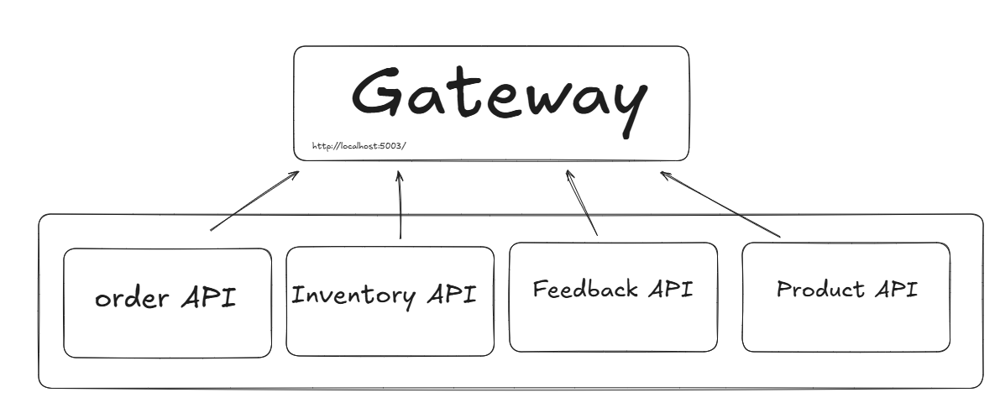

# SmartCafeteriaOrders

 docker compose up --build -d :use this command to start compose.yaml file 

It can happen that not all apps will start or they will immediately turn off. The reasons for this can be the following errors:

- Unhandled exception. Microsoft.Data.SqlClient.SqlException (0x80131904): A network-related or instance-specific error occurred while establishing a connection to SQL Server. The server was not found or was not accessible. Verify that the instance name is correct and that SQL Server is configured to allow remote connections. (provider: TCP Provider, error: 40 - Could not open a connection to SQL Server)

- Unhandled exception. Microsoft.Data.SqlClient.SqlException (0x80131904): Database 'MyDatabase' already exists. Choose a different database name.

To fix these issues, simply restart the affected services by pressing the individual start button in Docker Desktop.

If the RabbitMQ image is not healthy, increase the values for:
   - timeout: x s
   - retries: x

Marias Feedback API: https://github.com/Bumbleebeezz/Labb2CleanCode
Tiinas Procutcts API: https://github.com/TiiVa/SmartCafeteria.ProductMicroservice
Felixs Inventory API, our Gateway and compose file: https://github.com/felixAmark92/Microservices - in repo only InventoryService, Gateway and compose.yaml are in use 
Izabelas Order API: https://github.com/HesperisNivea/SmartCafeteriaOrders  

To test enpoints use f.e. Postman: 
url: http://localhost:5003/

Order endpoints:

- GET : /orders 
- GET : /orders/id
- POST : /orders 
[Body]
{
  "id": 3,
  "totalPrice": 342
}
- PUT : /orders
{
  "id": 3,
  "totalPrice": 342
}
- DELETE : orders/id